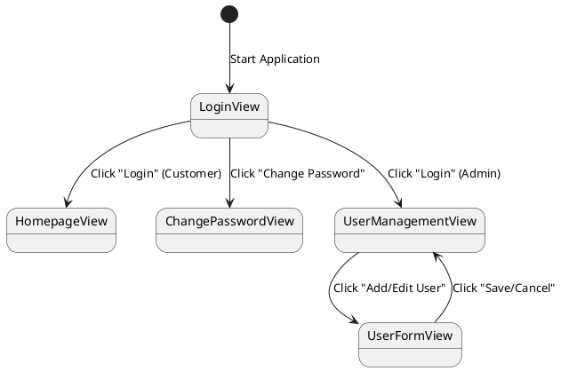
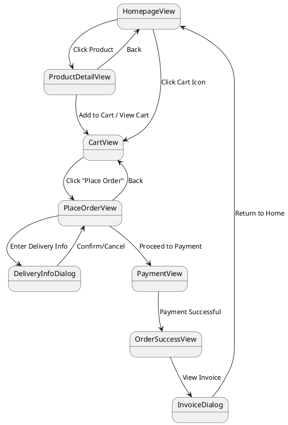
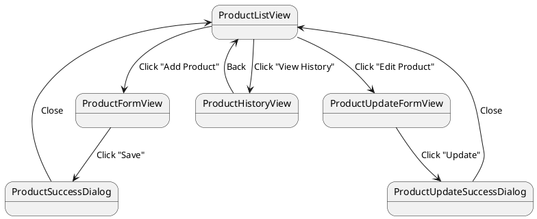
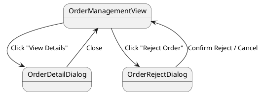

# Screen Transition Diagrams

Here are the four core flows broken down into **Simple Text Flows** (easy for self-drawing on Draw.io/Figma) and their corresponding **PlantUML Code**.

---

## Flow 1: Authentication & User Management
*Transition Pattern: Hub and Spoke / Sequential*

**Simple Flow for Self-Drawing:**
1. **Login View** is the starting point.
2. From Login View, user can click "Login" -> transitions to **Homepage View** (if customer) OR **User/Product Management View** (if Admin).
3. From Login View, user can click "Change Password" -> transitions to **Change Password View**.
4. From User Management View, admin clicks "Add/Edit User" -> transitions to **User Form View**.

**PlantUML Code:**

---

## Flow 2: Customer Shopping Flow
*Transition Pattern: Sequential (with some Hub and Spoke from Homepage)*

**Simple Flow for Self-Drawing:**
1. Start at **Homepage View**.
2. Click on a product -> **Product Detail UI View**. (Can go back to Homepage).
3. From Homepage or Product Detail, click "Cart" -> **Cart View**.
4. From Cart View, click "Place Order" -> **Place Order View**.
5. From Place Order View, click "Delivery Info" -> **Delivery Info Dialog** (Modal).
6. After Delivery Info, proceed to -> **Payment View**.
7. After Payment success -> **Order Success View**.
8. From Order Success View, view -> **Invoice Dialog**.

**PlantUML Code:**

---

## Flow 3: Admin Product Management
*Transition Pattern: Hub and Spoke*

**Simple Flow for Self-Drawing:**
1. Start at **Product List View** (The Hub).
2. Click "Add Product" -> **Product Form View**.
   - On Save -> **Product Success Dialog**, then back to Product List View.
3. Click "Edit Product" -> **Product Update Form View**.
   - On Update -> **Product Update Success Dialog**, then back to Product List View.
4. Click "View History" -> **Product History View**, then back to Product List View.

**PlantUML Code:**

---

## Flow 4: Admin Order Management
*Transition Pattern: Hub and Spoke*

**Simple Flow for Self-Drawing:**
1. Start at **Order Management View**.
2. Click "View Details" on an order -> **Order Detail Dialog** (Modal).
3. From Order Detail Dialog (or list), click "Reject Order" -> **Order Reject Dialog** (Modal).
4. After Rejecting, return to **Order Management View**.

**PlantUML Code:**

